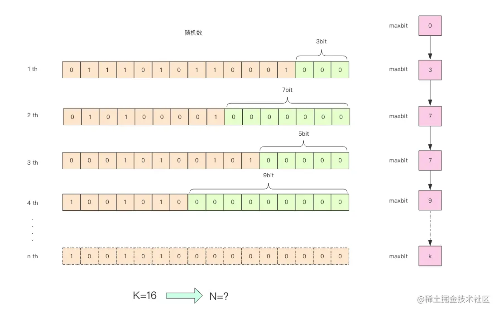

## HyperLogLog 实现原理
---
HyperLogLog 的使用非常简单，但是原理比较复杂，为了方便立即 HyperLogLog 的内部实现原理，下面给出这张图

这张图的意思是说，给定一些列随机数，我们记录下低位连续 0 位的最大长度 k，通过这个 k 值可以估算出随机数的数量。首先不要问为什么，我们编写代码来做一个实验，观察下随机整数的数量和 k 值的关系

## 调和平均数
---
调和平均数(harmonic mean)，是求一组数值的平均数的一种，一般是在计算平均速率时使用。
调和平均数是将所有的数值取倒数并求其平均数后，再将此算术平均数取倒数而得，其结果等于数值的个数除以数值倒数的总和。一组正数 x1,x2,.....xn 的调和平均数的计算公式为：

或者：

在 hyperloglog 的实验中，我们使用调和平均数的目的在于：普通的平均数可能因为个别离群值对平均数产生较大的影响，调和平均数可以有效地平滑离群值的影响