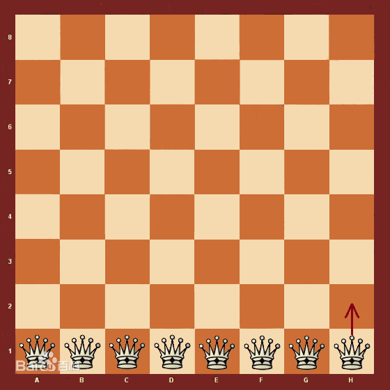
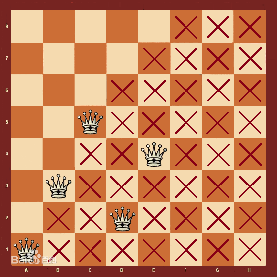
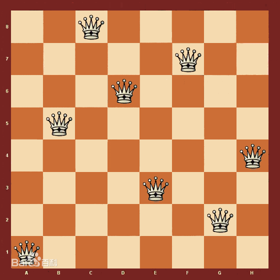

### 回溯算法

八皇后的问题如果用穷举法需要尝试 8^8 = 16,777,216 种情况。每一列放一个皇后，可以放在第 1 行，第 2 行，..... 直到第 8 行。穷举的时候从所有的皇后都放在第一行的方案开始，检验皇后之间是否会相互攻击。如果会，把列 H 的皇后挪一格，验证下一个方案。移动到底就"进位"到列 G的皇后挪一格，列 H 的皇后重新试过全部的 8 行。这种方法是非常低效的，因为它并不是那里有冲突就调整那里，而是盲目地按照既定的熟悉怒枚举所有的可能方案。

回溯算法优于穷举法。将列 A 的皇后放在第一行以后，列 B 的皇后在第一行已经发生冲突。这时候不必继续放列 C 的皇后，而是调整列 B 的皇后到第二行，继续冲突放第三行，不冲突了才开始进入列 C。如此可一次放下列 A 至 E 的皇后，如图 2 所示。将每个皇后往右边横向、斜向攻击的点位用叉标记发现列 F 的皇后无法安放。这时候回溯到列 E 的皇后，让其位置由第 4 行调整至第 8 行，进入列 F，发现黄年后依然无法安身，再次回溯到列 E。此时 列 E 已经枚举完所有的情况，回溯至列 D，将由其第 2 行移至第 7 行，再进入列 E 继续。

按此算法最终找到如图 3 所示的解，成功在棋盘中放下 8 个“和平共处”的皇后。继续寻找直到找到全部的解，共 92 个。

回溯算法求解八皇后的原则是：有冲突解决冲突，没有冲突往前走，无路可走往回退，走到最后是答案。为了加快冲突的判断速度，可以给每行和每个方向的每条对角线皇后占据建立标志数组。放下一个皇后做标志，回溯时挪动一个皇后后清除标识。后面可以看到解法 2 是采用这种回溯思路。。。。

参考：
1、百度百科：https://baike.baidu.com/item/%E5%85%AB%E7%9A%87%E5%90%8E%E9%97%AE%E9%A2%98?fromModule=lemma_search-box#2_6
2、github:https://zq99299.github.io/dsalg-tutorial/dsalg-java-hsp/06/03.html#%E5%85%AB%E7%9A%87%E5%90%8E%E6%80%9D%E8%B7%AF%E5%88%86%E6%9E%90
3、视频网站 https://www.bilibili.com/video/BV1qK4y1T71b/?spm_id_from=333.337.search-card.all.click&vd_source=5a931c15c89a0f0e403fd0e6003b1911

需要先看百科，有个入门概念，再反复观看视频，理解其中的原理，最后结合参考 2 的注解，就能理解回溯法解决 N 皇后的问题了。