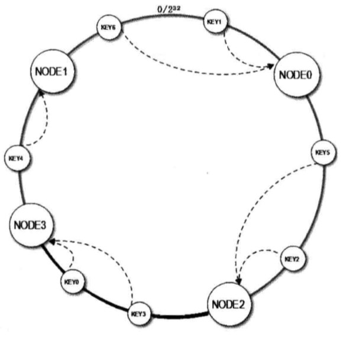
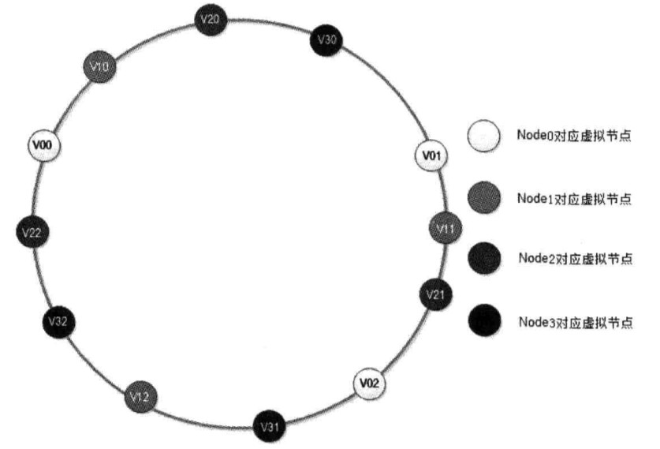
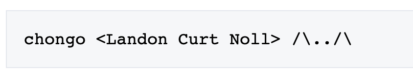

--接 ConsistentHash.java 的描述
当服务器需要扩容的时候，只需要将新加入的服务器的 hash 值放入到一致性 hash 环中,由于 key 是顺时针超找最近距离，因此只会影响整个环中的一小段。加入新节点 NODE3 后，原来的 Key 大部分还能继续计算到原来的节点，只有 Key3，Key0 从原来的 NODE1 重新计算到 Node3，这样就保证大部分被缓存数据还可以被命中。当节点删除时，其他节点在环上的映射不会发生改变，只是原来打在对应节点的 key 现在会转移到顺时针方向的下一个节点上。


## Hash 数据倾斜
---
新加入的节点 NODE3 直影响了原来的节点 Node1，也就是说原来需要访问 Node1 的请求现在需要访问 Node3（概率上是 50%），但是原来的节点 Node0 和 Node2 不受影响，这就意味着 Node0 和 Node2 缓存数量和负载压力是 Node1 和 Node3 的两倍。

## 虚拟节点
---
为了解决这个问题，最好的办法就是扩展整个环上的节点数量，可以将每台物理节点虚拟为一组虚拟节点，使得 Hash 环在空间上的分割更加均匀。
这样以来，节点上的 Server 节点就变成虚拟节点，在查找时，首先根据 key 值找到环上的虚拟节点，然后再根据虚拟节点找到真实的服务节点。虚拟节点的数量足够多时，就会使得节点在 Hash 环上的分布更加随机化，也就是增加或者删除一台缓存服务器，都会较为均匀地影响原来集群中已经存在的缓存服务器。

至于一个物理节点应该被拆分成多少个虚拟节点，可以先看下面这张图

横轴表示需要为每台服务器扩展的虚拟节点倍数，纵轴表示的是实际物理服务器的数量。可以看出，物理服务器数量少，则需要更大的虚拟节点；反之物理服务器比较多，虚拟节点就可以少些。
比如有 10 台物理服务器，那么差不多需要为每台服务器增加 100~200个虚拟节点才可以到达真正的负载均衡。
## 一致性 Hash 的缺陷
---
虽然一致性 hash 算法已经十分完善，但是还是有很多不足的地方
1. hash 环上的节点非常多或者更新频繁的时候，查询效率比较低下
2. 整个 Hash 环需要一个服务路由来做负载均衡，存在单点问题

针对这两个问题，Redis 在实现自己的分布式集群方案时，采用了 P2P 结构的哈希槽算法
1. 使用哈希槽
    1. Redis Cluster 通过分片的方式将整个集群缓存划分为 16384 个槽，每个缓存节点就相当于 Hash 上的一个节点，接入集群时，所有的实例都均匀占有这些槽，当需要查询一个 key 时，首先根据 key 的 hashcode 取模 16384 来得到 key 属于那个槽，并映射到缓存实例上。
    2. 为了方便描述，将 16384 抽象为 20 个哈希槽单位，在增加缓存实例的时候，假设原来有 4 个节点，分配的哈希槽位0-4,5-9,10-14,15-19 现在增加一个节点，Redis Cluster 的做法是将之前每台服务器的一部分哈希槽移动到新增加的第 4 个节点上，更新后的哈希槽分配为 1-4,6-9,11-14,16-19；而第 4 个节点为 0,5,10,15。删除也是同理
2. 去中心化
    1. 每个节点都保存有完整的哈希槽-节点映射，也就是说，每个节点都知道自己拥有哪些哈希槽，已经某个确定的哈希槽究竟对这那个节点
    2. 无论向哪个节点发出寻找 key 的请求，该节点都会通过请求 hash 再取余计算得出 key 究竟在哪个哈希槽中，如果目标槽属于当前节点管理那么，当前节点就会相应请求，否则会将请求转发到槽所对应的节点上。

一致性哈希算法的实现
=================
数据结构选取
-----------------
一致性 hash 算法首先需要考虑的问题是：构造一个长度为 2^32 的整数环，根据节点名称的 hash 值将服务器节点放置在整个 Hash 环上。

### 排序 + list

算出所有的待加入的数据结构的节点名称的 Hash 值放入一个数组中，然后使用排序算法将其从小到大进行排序，最后将排序后的数据放入 list 中。之后，待路由的节点，只需要在 List 中找到第一个 Hash 值比它大的服务器节点就可以了。比如服务器节点的 hash 值为 [0,2,4,6,8,10]，待路由的节点是 7，则只要找到第一个比 7 大的整数，也就是8，就是我们要找到的需要路由过去的服务器节点。

直接使用 Arrays#sort() 时间复杂度为 O(nLogn) ，则宗的事件复杂度为：
1. 最好的情况，一次查找O(1) + O(NLogN)
2. 最坏的情况，最后一次找到 O(n) + O(nlogN)

则总的时间复杂度为 O(nLogn)

### 遍历 + List
由于排序比较消耗性能，那么可以选择不排序，直接遍历的方式：

    1. 服务器节点福排序，其 hash 全部放到一个 list 中
    2. 等待路由的节点，算出其 Hash 值，由于指明了顺时针，云次遍历 List，比待路由节点 Hash 值大的算出差值并记录，比待路由节点的 Hash 值小的则忽略
    3. 算出所有的差值后，最小的那个，就是最终要路由过去的节点

现在选下此种方法的时间复杂度
1. 最好的情况是只有一个服务器节点的 Hash 值大于待路由节点的 Hash 值：O(N) + O(1)
2. 最坏的情况是所有的服务器节点的 Hash 值都大于待路由的节点的 Hash 值，时间复杂度为 O(N) + O(N)- 选择 O(N)。不过在我看来就是一遍遍历的事，不存在最好最坏，不过不影响结果，整体复杂度为 O(N)

### 红黑树
选用红黑树的原因：
1. 红黑树的主要作用是用于存储有序的数据，因此相当于省略了排序这一步，效率很高
2. JDK 里面提供了红黑树的实现：TreeMap 和 TreeSet 
3. 红黑树提供了一个方法 ceilingEntry(Integer key) 可以直接获取 key 右边的第一个节点，如果节点为空，则表示已经到达尾部，则直接取树的第一个节点
事件复杂度分析: O(logN)

Hash 重写
--------
服务器节点一般用字符串表示，比如 `192.168.1.1`, 根据字符串得到其 hash 值，所以一个重要的问题就是 jdk 本身的 Hash 算法是否满足要求：即是否在环上分布均匀
```java
static void runStringHashTest() {
        String ipPrefix = "192.168.0.";
        String port = "1111";
        for (int i = 0; i < 5; i++) {
            String ip = ipPrefix + i + ":" + port;
            System.out.println(ip + " 的哈希值：" + Math.abs(ip.hashCode()));
        }
    }
/** 输出结果 **/
192.168.0.0:1111 的哈希值：1845870087
192.168.0.1:1111 的哈希值：1874499238
192.168.0.2:1111 的哈希值：1903128389
192.168.0.3:1111 的哈希值：1931757540
192.168.0.4:1111 的哈希值：1960386691
```
明显可以看出，在 [0,2^32-1] 这个区间，5 个 hashcode 值仅仅分布在一个小的区间内，这样会导致某个某个服务器的负载会特别大（比如说 0-1845870087 之间的回查找 第一个，而 哈希值大于 1960386691 的请求也会查找第一个）。因此需要一种新的 Hash 值的方法，这种方法重新计算 Hash 值的算法有很多，比如 CRC32_HASH,FNV1_32_HASH, KETAMA_HASH 等，其中 KETAMA_HASH 是默认的 Redis 推荐的一致性 Hash 算法，用别的 Hash 算法也可以，比如 FNV1_32_HASH 的计算效率就会比较高一些，这里选用 FNV1_32_HASH 算法

虚拟节点
-------
没有虚拟节点，就会出现前文所说的 hash 环数据倾斜的问题，某种程度上来说，这样就失去了负载均衡的意义，因此负载均衡的目的就是为了使目标服务器均分所有的请求。

虚拟节点跟真实节点之间的比例关系，前文已经说明

构造虚拟节点需要考虑考虑两个问题：
1. 真实的节点如何对应多个虚拟节点
2. 虚拟节点找到后如果还原成为真实的节点

参考别人的想法：可以在每个真实节点的字符串后面增加一个后缀，比如 "192.168.0.0:1111" 编程虚拟节点后就是
"192.168.0.0:1111&&VN0","192.168.0.0:1111&&VN1","192.168.0.0:1111&&VN2","192.168.0.0:1111&&VN3", 还原的时候只需要从头截取到字符串 "&&" 位置就可以了。

代码实现
-------
请参考 ConsistenHash.java

FNV1_32_HASH 哈希算法简介
-----------------------
FNV 算法属于非密码学函数，它最初由 Glenn Fowler and Phong Vo 在 1991 首次提出，最后由 Landon Curt Noll 完善，故该算法以三人姓的手写字母命名。
FNV 算法目前有 3 种，分别是 FNV-1，FNV-1a 和 FNV-0，但是 FNV-0 算法已经被废弃了。FNV 算法的哈希结果有 32,64,128,256,512,1024 等长度。其他长度，可以根据 官方网站自行更改 (http://www.isthe.com/chongo/tech/comp/fnv/)

FN1 算法过程如下：
```java
hash = offset_basis
for each octet_of_data to be hashed
hash = hash * FNV_prime
hash = hash xor octet_of_data
return hash
```

参数说明（以 32 位为例）：
所有参数中，除了 octet_of_data 之外，都是 32 位无符号整形，即 hash,offset_basis、FNV_prime 类型都是 32 位无符号整形；
octet_of_data 的类型是 8 位无符号整形；

FNV_prime 为算法的质数，根据官方的说法，这个 FNV_prime 的质数是如何得到的，根据官方的说法如下
The FNV_prime is dependent on n, the size of the hash
>    32 bit FNV_prime = 2^24 + 2^8 + 0x93 = 16777619
>
>    64 bit FNV_prime = 2^40 + 2^8 + 0xb3 = 1099511628211
>
>    .....

32 位的 offset_basis 的值是 2166136261，这个数是怎么来的那，根据维基百科的说法：是通过使用下面这个作者的签名并经过运算得到的



算法的伪代码如下：

```c
hash_bits = insert_the_hash_size_in_bits_here;
FNV_prime = insert_the_FNV_prime_here;
offset_basis = 0;
offset_str = "chongo <Landon Curt Noll> /\\../\\";
hash_mod = 2^hash_bits;

str_len = strlen(offset_str);
for (i=1; i <= str_len; ++i) {
    offset_basis = (offset_basis * FNV_prime) % hash_mod;
    offset_basis = xor(offset_basis, ord(substr(offset_str,i,1)));
}

print hash_bits, "bit offset_basis =", offset_basis;

```

