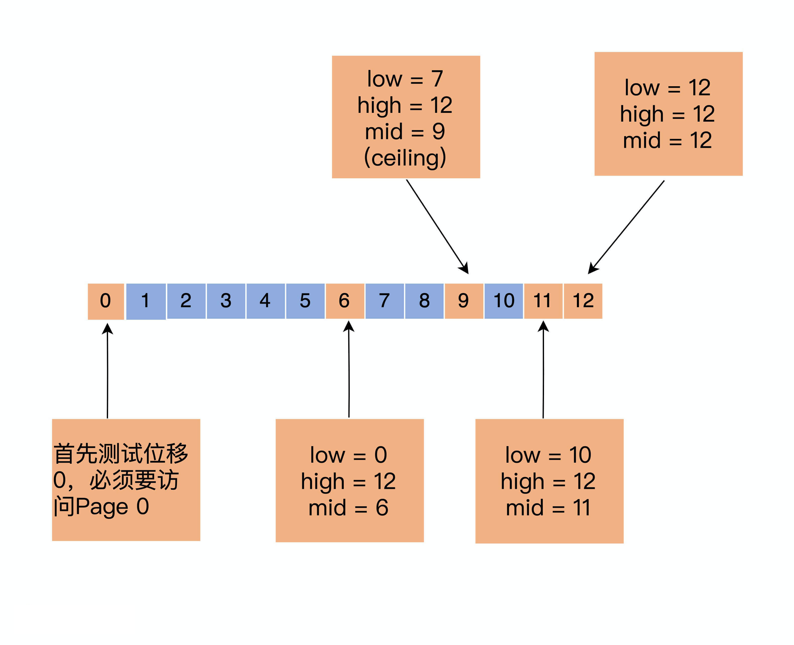
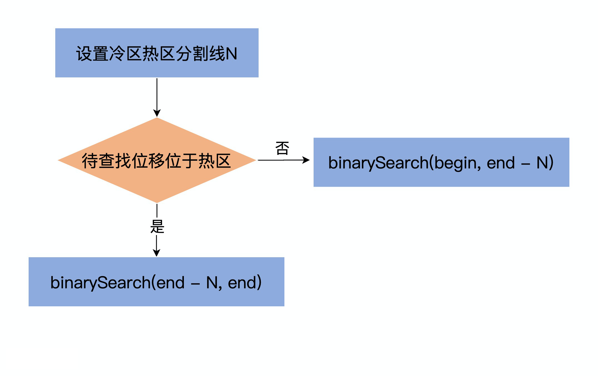

## Kafka 索引使用的改进的二分查找
 
 Kafka 在写入索引文件的方式是在文件末尾追加写，而几乎所有的索引查询都集中在索引的尾部(follower 的 fetch 和已存在的 consumer 拉取数据都是在拉取最近的数据)
 而目前几乎所有的操作系统都是用 LRU 或类似于 LRU 的机制来管理缓存页。这么来看的话，LRU 机制非常适合于 Kafka 索引的访问场景的。
 
 但，这里有个问题是，当 Kafka 在查询索引的时候，原始的二分查找算法并没有考虑到缓存的问题，因此很可能会导致一些不必要的缺页中断(Page Fault)。
 此时，Kafka 线程会被阻塞，等待对应的索引从物理磁盘中读出并放到页缓存中。
 
 下面我们举个栗子来说明一下这个情况。假设 Kafka 的某个索引占用了操作系统的页缓存 13 个页（Page），如果待查找的位移值位于最后一个页上，也就是 Page 12,
 那么标准的算法会依次读取页号 0、6、9、11 和 12，具体的推算流程如下
 

通常来说，一个页面保存了成百上千的索引项数据(8字节一项，一个page 是 4K=4096字节，一个 Page 能保存 512 个索引项)。随着索引文件不断的被写入，
Page #12 不断地被填充新的索引项。如果此时索引查询方都来自 ISR 副本或者 Lag 很小的消费者，那么这些查询大多几种在对 Page#12 的查询，因此，
Page #0,6,9,11,12 一定会经常性地被访问到。也就是说，这些页一定保存在页缓存上。后面当新的索引填满了 Page #12 后，页缓存就会申请一个新的 Page 来保存
索引项，即 Page #13。

现在，新索引项保存在 Page #13 中。如果要查找最新索引项，原始的二分查找算法将会依次访问 Page  #0,7,10,12,13。此时，问题来了：Page #7 和 10 
已经很久没被访问过了，它们大概率不会在页缓存中，因此，一旦索引开始使用 #Page 13，就会发生 Page Fault，等待那些冷页从磁盘中被加载到缓存。根据国外用户的测试，
这个加载过程可能长达 1 秒。

显然，这是一个普遍的问题，即每当索引文件占用 Page 数发生变化时，就会强行变更二分查找的路径，从而出现不在页缓存中的冷数据必须要加载到页缓存的情形，
而这种加载过程是非常耗时的。

基于这个问题，社区提出了改进版本的二分查找策略，也就是缓存友好的搜索算法。总体思路是，代码将所有索引项分成两部分：热区(Warm Area) 和 冷区 （Cold Area),
然后分别在这两个区执行二分查找算法，如下所示

 
 
 咋一看，该算法并没有什么高大上的改进，仅仅是吧搜索区域分成了冷、热两个区域，然后有条件地在不同的区域执行普通的二分搜索罢了。实际上，
 这个改进算法提供了一个重要的保证：**它保证那些经常需要被访问的 Page 组合是固定的**
 
 想象刚才的例子，同样是查询最热的那部分数据，一旦索引占用了更多 Page，要遍历的 Page 组合就会发生变化。这是导致性能下降的主要原因。
 
 这个改进算法的最大好处在于，**查询最热那部分数据所遍历的 Page 永远都是固定的，因此大概率在页缓存中，从而避免无意义的 Page Fault**。
 
 
 