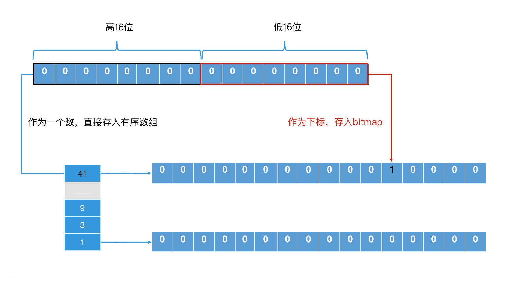
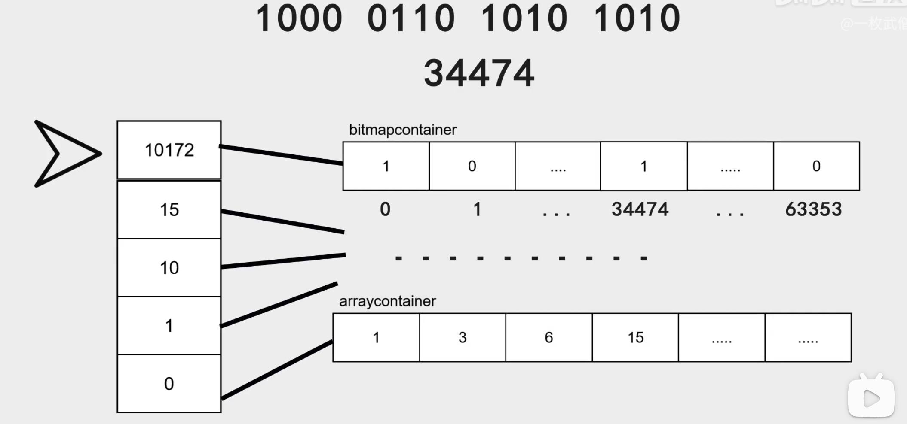
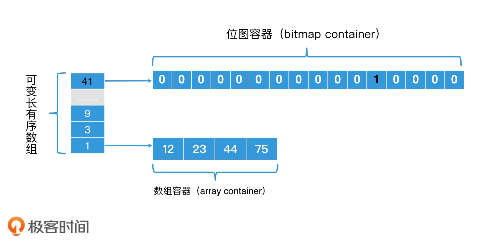
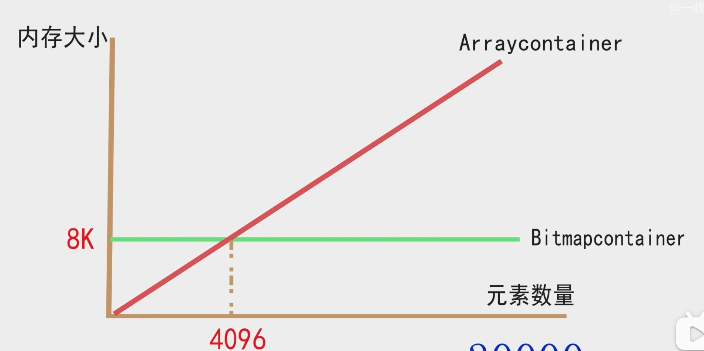

## Roaring BitMap 学习

### Bitmap vs Roaring Bitmap
bitmap 存在一个致命的问题，空间浪费严重，我们都知道，bitmap 会根据存储的最大值来申请空间，如果对于一个基数很小的数据来说，比如，1,2,4 和 1_000_000
那它依然会申请一个长度为 100 万的 bit 数组，这种情况就造成了空间的极大浪费，为了避免空间的浪费，Roaring Bitmap 就诞生了。它可以提升计算效率的同时避免空间浪费

### Roaring BitMap 简介

首先，Roaring Bitmap 将一个 32 位的整数划分为 2 部分，一部分是高 16 位，另一部分是底 16 位。对于高 16 位，Roaring Bitmap
将它存储到一个有序数组中，这个有序数组中的每一位都是 1 个“桶”；而对于低 16 位，Roaring Bitmap 则将它存储在一个 2^16 位图中中，将相应的位置置为 1。这样，每个桶都会对应一个 2^16 的位图。

 Roaring Bitmap 存储过程 

接下来，如果我们要确认一个元素是否在 Roaring Bitmap 中存在，通过两次查找就能确认了。第一个步是以高 16 位在有序数组中二分查找，看对应的桶是否存在。如果存在，第二步是将桶中的位图取出，拿着低 16 位在位图中查找，判断相应位置是否为 1。第一步查找由于数据是二分查找，因此时间代价是 O(logn); 第二步是位图查找，因此时间代价是 O(1)。

比如说我们现在要存储 666666666 这个数字,二进制为 0010 0111 1011 1100 1000 0110 1010 1010。将该值 无符号右移 16 位 得到 0010 0111 1011 1100 ,10 进制为 10172，通过二分查找，可以快速定位到这个桶，如果不存在，则创建一个。之后计算低 16 位 1000 0110 1010 1010 ，10 进制为 34474，根据该值可以快速找到 bitmap 中的位置，并将其设置为 1. 同理，其他数值也可以向上述方式进行存储。

通过上图我们可以发现，container 有两种 ：arraycontainer 、bitmapcontainer，为何会有这 2 中container，下面具体来说明：

所以你看，这种 **有序数组和位图结合起来的设计思路** 是能够保证高效检索的。那么它到底是怎么节省空间的那？

我们来看一个极端的例子：

如果一个 posting list 中，所有的元素的高 16 位都是相同的，那在有序数组部分，我们只需要一个 2 字节的桶（注：每个桶都是一个 short 类型的整数，因此只有 2 字节。如果数组提前分配好了 2^16 个桶，那就需要 128K 字节的空间，因此使用可变长数组更节省空间）。在低 16 位部分，因为位图长度是固定的，都是 2^16 个 bit，那所占空间就是 8K 个字节。

同样都是 32 位整数，这样的空间消耗相比于我们在位图中计算的 512M 字节来说，大大地节省了空间！

我们会发现，相比于位图，这种设计方案就是通过 **将不存在的桶的位图空间给省去这样的方式，来节省存储空间的**。而代价就是将高 16 位的查找，从位图的 O(1)的查找转为有序数组的 log(n) 查找。

那每个桶对应的位图空间，我们是否还能优化那？

前面我们说过，当位图中的元素太稀疏时，其实我们还不如使用链表。这个时候，链表的计算更加快速，也更加节省空间。Roaring Bitmap 就是基于这个思路，对低 16 为的位图部分进行了优化：如果一个桶中存储的数据少于 4096 个，我们就**不使用位图，而是直接使用 short 类型的有序数组存储数据**。同时，我们使用可变长数组机制，让数组的初始化长度是 4，随着元素的增加在逐步调整数组长度，上限是 4096。这样一来，存储空间就会低于 8K，也就小于使用位图所占用的存储空间了。

bitmap container 是一个长度恒定为 1024 的 long 类型数组(2^16 bit 可以用多长的 long 来表示那，通过 jdk bitset 的学习，我们知道需要 2^(16-6) ，也就是 2^10=1024 个 long 类型的数组），bitmap container 的容器固定为 2^16bit = 2^13 byte= 8K byte，

总结来说，一个桶对应的存储容器有 2 种，分别是数组容器和位图容器（其实还有一种压缩的 runContainer，它是对连续元素通过只记录初始元素和后续个数。由于它不是基础类型，需要手动调用 runOptimize() 函数才会启用，这里就不展开说了）。那在实际应用的过程中，数组容器和位图容器是如何转换的那？这里有 3 中情况。

* 第一种，在一个桶中刚插入数据时，因为数据量少，所以我们就默认使用**数组容器**；

* 第二种，随着数据插入，桶中的数据不断增多，当数组容器中的元素个数大于 4096 个时，就从数组容器转换为位图容器；

* 第三种，随着数据的删除，如果位图容器中的元素格式小于 4096 个，就退化回**数组容器**。

这个过程跟 HashMap 的链表和红黑树之间的互换是一致的。

 使用数组容器和位图容器并可以相互转换 

 使用数组容器和位图容器并可以相互转换2 

参考文档

https://blog.csdn.net/penriver/article/details/119736050
