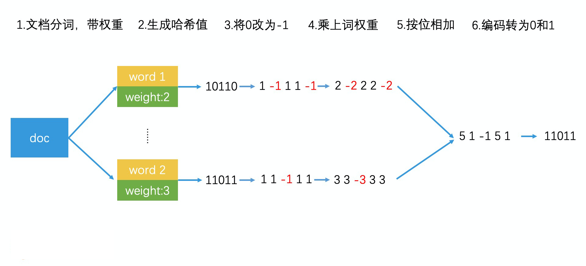
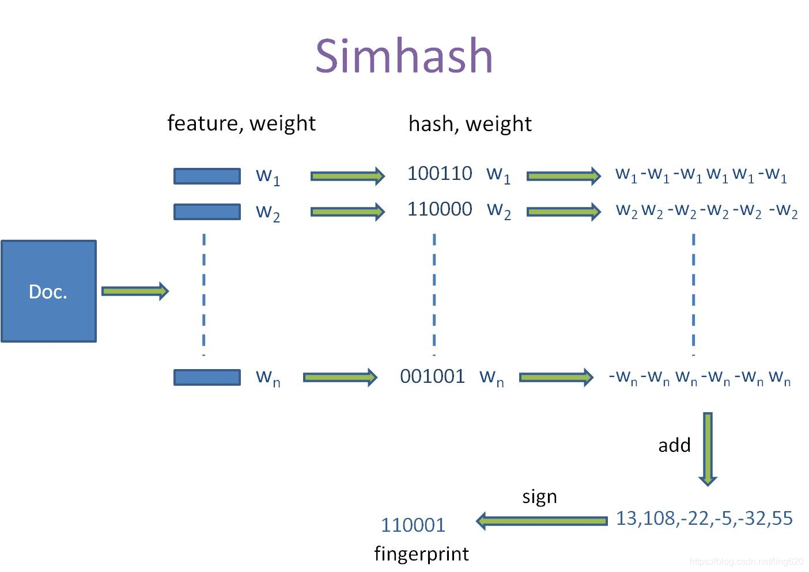
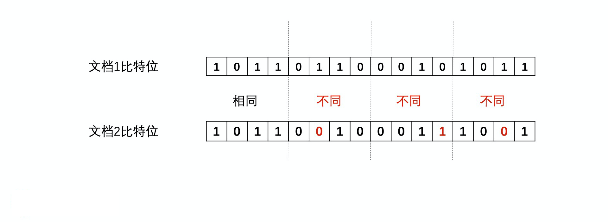
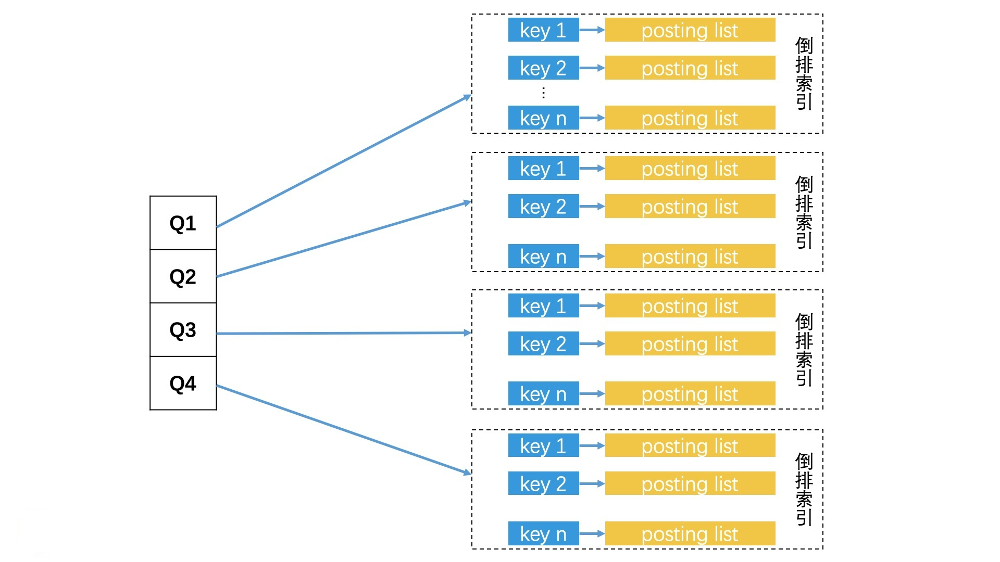

## 局部敏感性哈希

我们可以利用哈希思路，将高维空间的点映射成低位空间的一维编码。换句话说，我们通过计算不同文章的哈希值，就能得到一维哈希编码，如果文章内容 100% 相同，那他们的哈希值就是相同的，也就是相当于编码相同

不过，如果我们用的是普通的哈希函数，只要文档中的关键词有一些轻微变化（比如改变了一个字），哈希值就会大相径庭。但是我们又希望，整体相似度高的两篇文章，通过哈希计算以后得到的值也是相近的。因此，工业界设计了一种哈希函数，它可以让相似的数据通过哈希计算后，生成的哈希值是相近的（甚至是相等的）。这种哈希函数就是**局部敏感性哈希**（Locality-Sensitive-Hashing）

普通哈希 vs 局部敏感哈希

### 汉明距离（Hamming Distance）

在利用局部敏感性哈希值来判断文章相似性的时候，我们会依次来表示比特位的差异数的**汉明距离**为标准。我们可以认为如果两个对象的哈希值的汉明距离低于 k，那么他们是相近的。举个栗子，如果有两个哈希值，bit 位分别为 00000 和 10000。我们可以看到，它们只有第一个比特位不一样，那它们的汉明距离就是 1。如果我们认为汉明距离在 2 之内的哈希值都是相似的，那他们就是相似的。

## SimHash 简介

simHash 算法是 GoogleMoses Charikear 于 2007 年发布的一片论文 《Detecting Near-duplicates for web crawling》 中提出的，专门用来解决万亿级别的网页去重任务。

simHash 是局部敏感性哈希的一种，其主要思想是**降维**，将高维的特征向量映射成低纬的特征向量，再通过比较两个特征向量的 **汉明距离** 来确定文章之间的相似性。

### SimHash 是如何构造的

上述构造局部敏感函数的方式有一些缺陷，在原来的空间中，不同维度本来是有着不同权重的，权重代表了不同关键词的重要性，是一个很重要的信息。但是空间被 n 个超平面随机划分之后，权重信息在某种程度上就被丢弃了。

为了保留维度上的权重，并且简化整个函数生成的过程，Google 提出了一种简单有效的局部敏感性函数，叫做 **SimHash**。它其实是用一个普通哈希函数代替了 n 次随机超平面划分，并且这个普通哈希函数的作用对象也不是文档，而是文档中的每一个关键词。这样一来，我们就能在计算的时候留下关键词的权重了。让我们来看看 simhash 实现的细节。

方便起见，我们就以 Google 官方介绍的 64 位 SimHash 为例，来说一说它构造的过程。整个过程，我们可以总结为 5 步。

1. 选择一个能将关键词映射到 64 位正整数的普通哈希函数。
2. 使用该哈希函数给文档中的每个关键词生成一个 64 位的哈希值，并将该哈希值中的 0 修改为 -1，比如说，关键词 A 的哈希编码为 <1,0,1,1,0> ,那我们做完转换后，编码就变成了 <1,-1,1,1,-1>。
3. 将关键词的编码乘上词自己的权重。如果关键词编码为<1,-1,1,1,-1>，关键词权重为2，最后我们得到的关键词编码就变成了<2,-2,2,2,-2>。
4. 将所有关键词的编码按位相加，合成一个编码。如果两个关键词的编码分别为<2,-2,2,2,-2> 和 <3,3,-3,3,3>，那么他们相加后就会得到<5,1,-1,5,1>。
5. 将最终得到的编码中大于 0 的值变为 1，小于等于0 的变为 0。这样，编码 <5,1,-1,5,1> 就被转换为<1,1,0,1,1> 

simhash 流程图2

### SimHash 更加官方的构造 5 步

`simHash 算法总共分为 5 个流程：分词，hash，加权，合并，降维。`

1. 分词
    对处理文档进行中文分词，得到有效的特征及其权重。可以使用 TF-IDF 方法获取一篇文章权重最高的 topK 个词(feature) 和权重（weight）。即可使用 `jieba.analyse.extract_tags()`来实现
2. hash
    对获取的次（feature），进行普通的哈希操作，计算 hash 值，这样就得到了一个长度为 n 位的二进制，得到（hash：weight）的集合
3. 加权
    在获取的 hash 值的基础上，根据对应的 weight 值进行加权，即 W=hash*weight。如果 hash 的bit 位为 1 则 weight 为正，
为 0 则 weight 为负值。例如一个单次经过hash后得到 {010111:5}，经过步骤 3 之后可以得到表[-5,5,-5,5,5,5]。
4. 合并
    将上述得到的各个向量的加权结果进行求和，变成只有一个序列串。例如 [-5,5,-5,5,5,5]、[-3,-3,-3,3,-3,3]、[1,-1,-1,1,1
    1]进行列方向累加得到 [-7,1,-9,9,3,9], 这样，我们就对一个文档得到一个长度为 64 的列表
5. 降维
   对于得到的 n-bit 签名的累加结果的每个值进行判断，大于0则为1，否则为0，从而得到该语句的 simhash 值。例如 [-7,1,-9,9,3,9] 得到 010111，这样我们就得到一个文档的 simhash 值。最后根据不同语句的 simhash 值的汉明距离来判断你相似度。

simhash 流程图

通过这样巧妙的构造，SimHash 将每个关键词的权重保留并且叠加，一直留到最后，从而使得高权重的关键词的影响能被保留。从图中可以看出，整个文档的 SimHash 值和权重最大的关键词 word2 的哈希值是一样的。这就体现了高权重的关键词对文档的最终哈希值的影响。此外，SimHash 通过一个简单的普通哈希函数就能生成 64 位哈希值，这替代了随机划分 64 个超平面的复杂工作，也让整个函数的实现更简单。

### 如果对局部敏感哈希值进行相似检索？

和其他局部敏感哈希函数一样，如果两个文档的 Simhash 值的汉明距离小于 k，我们就认为他们是相似的。举个栗子，在 google 的实现中，k 的取值为 3。这个时候，检索相似文章的问题就变成了找出汉明距离为 3 之内的所有文档。如果是一个个文档比较的话，这就是一个遍历过程，效率很低，有没有更高效的检索方案那？

一个直观的想法是，我们可以针对每一个比特位做检索。由于每个比特位之后 0 和 1 这两个值，一共 64 个比特位，也就一共 2*64 共 128 个不同的 key(这里的计算方式，我想了半天持怀疑态度)，将所有的文档根据自己每个比特位的值，加入到对应的倒排索引的 posting list 中。这样，当要查询一个和文档相似的其他文档的时候，我们只需要通过 3 步就可以实现了，具体的步骤如下：

1. 计算出待查询文档的 Simhash 值；
2. 以该 SimHash 值中的每个比特位的值作为 key，去倒排索引中查询，将相同位置具有相同值的文档都召回；
3. 合并这些文档，并一一判断那他们和要查询的文档之间的海明距离是否在 3 之内，留下满足条件的。

我们发现，在整个过程中，只要有一行比特位的值相同，文档就会被召回。也就是说，这个方案和遍历所有文档相比，只是排除掉了”比特位完全不同的文档“。因此，这种方法的检索效率并不高。

这又该如何优化那？Google 利用**抽屉原理**设计了一个更高效的检索方法。什么是抽屉原理那？简单来说，如果我们有 3 个苹果要放入 4 个抽屉，就至少有一个抽屉会是空的。那应用到检索上，Google 会将哈希值平均切分为 4 段，如果两个哈希值的比特位差异不超过 3 个，那这 3 个差异的比特位最多出现在 3 个段中，也就是说至少有一个段的比特位是完全相同的！因此，我们我们可以将前面的查下优化为”有一段比特位完全相同的文档会被召回“

如果汉明距离小于 3，那么 4 段中至少有1段完全相同

根据这个思路，我们可以将每个文档都根据比特位划分为 4 段，以每一段的 16 个比特位的值为 key，建立 4 个倒排索引。检索的时候，我们会把要查询文档的 SimHash 值也分为 4 段，然后分别去对应的倒排索引中，查询和自己这一段比特位完全相同的文档。最后，将返回的四个 posting list 合并，并一一判断他们的海明距离是否在 3 之内。

分段查询

通过使用 SimHash 函数和分段检索（抽屉原理），使得 google 能在百亿级别的网页中快速完成过滤相似网页的功能，从而保证了搜索结果的质量。