B 树
------
1. 前言

动态查找树主要有：二叉查找树 BST，平衡二叉查找树，红黑树，Btree/B+tree/B*-tree
前三者都是典型的二叉查找树结构，其查找的时间复杂度为`O(log2N)` 与树的深度有关，那么降低树的深度自然会提高查找效率。
但是我们需要面对这样一个事实：就是大规模数据存储中，实现索引查询这样的一个实际背景下，树节点存储的元素数量是有限的，这样会导致二叉查找树由于**树的深度过大而造成磁盘I/O读写过于频繁，进而导致查询效率低下**，因此人们能想到的办法就是降低树的高度，从而减少磁盘查询存取的次数。一个基本的想法是，采用**多叉树结构**（由于树的节点元素数量是有限的，自然该节点的子树数量也是有限的）
这样我们就提出了一个新的查找树结构——平衡多路查找树，即B-tree（B即 Balanced），B树是 Rudolf Bayer, Edward M. McCreight(1970)写的一篇论文《Organization and Maintenance of Large Ordered Indices》中首次提出的

后面我们会看到，B树的各种操作能使 B 树保持较低的高度，从而有效避免磁盘过于频繁的查找存取数据，达到有效提高查询效率的目的。在开始介绍 Btree 之前，我们来了解下硬盘的基础知识，以便能更好地了解为什么需要 Btree 这种数据结构

#### 2. 外存储器—磁盘

##### 2.1 磁盘的构造

磁盘是一个扁平的圆盘。盘面上有很多被称为磁道的圆圈，数据就记录在这些磁道上。磁盘可以是单片的，也可以是由若干盘片组成的盘组，每一个盘片上面有两个面。
如下图所示的6片盘组为例，除去最顶端和对低端的外侧面不存储数据之外，一共有 10 个面可以用来存储信息。


当磁盘驱动器执行读写时，盘片装在一个主轴上，并绕主轴高速旋转，当磁道在磁头下通过时，就可以进行数据的读写了。

##### 2.2 磁盘的读写原理和效率

磁盘上数据必须用一个三维地址来标识：柱面号、盘面号、块号（磁盘上的盘块）（ps：看着像天朝的几号楼，几单元，几零几）

读写磁盘一般要经过如下 3 个步骤：

    1. 首先移动臂根据柱面号使磁头移动到所需要的柱面上，这个过程被称为定位或者查找
    2. 如上图所示的 6 盘示意图中，所有的磁头都定位到了 10 个盘面的 10 条磁道上（磁头都是双向的，个人感觉是上下双向的）。这时候根据盘面号来指定盘面上的磁道
    3. 盘面确定以后，盘片开始旋转，将指定块号的磁道移动至磁头下。

经过上述 3 个步骤，指定数据的存储位置就被找到了，这时候就开始进行读写操作了。(ps:简单概括就是 柱面->盘面->磁道->开始读写)

访问某一具体信息，由 3 部分事件组成：
* 查找时间（seek time）Ts，晚上上述步骤（1）所需要的时间。这部分时间代价最高，最大可达到 0.1s 左右
* 等待时间（latency time）Tl，完成上述步骤（3）所需要的时间。由于盘片绕主轴旋转的速度很快，一般为 7200转/分，因此一般旋转一圈大约 0.0083s
* 传输时间(transmission time) Tt: 数据通过系统总线传送到内存的时间，一般传输一个字节的大概需要0.02us=2*10^(-8)s


**磁盘读取数据是以盘块(block) 为基本单位。位于同一盘块中的所有数据都能一次性被全部读取出来。而磁盘 IO 代价主要花费在查找的时间 Ts 上。一次你我们应该进行将相关信息存放在同一盘块，同一磁道中。或者至少放在同一柱面或者相邻柱面上，以求在读写信息时尽量减少磁头来回移动的次数，避免过多的查找事件Ts。** 

所以，在大规模数据存储方面，大量数据存储在磁盘中，而磁盘读写块(block)中某些数据时，首先需要定位到磁盘中的某块，如果有效地查找磁盘中的数据，需要一种合理高效的外存数据结构，就是下面所要重点阐述的B-tree 结构，以及相关的变种结构，B+ tree 和 B* tree

##### 2.2 局部性原理和磁盘预读
由于存储介质的特性，磁盘本身存取就比主存慢很多，再加上机械运动耗费，磁盘的存取速度往往是主存的几百分之一，因此为了提高效率，要尽量减少磁盘 IO。
为了达到这个目的，磁盘往往不是严格按需读取，而是每次都会预读，即使只需要一个字节，磁盘也会从这个位置开始，顺序向后读取一定长度的数据放入内存。
这样做的理论依据是计算机科学中的著名的局部性原理：
**当一个数据被用到时，其附近的数据也通常会被马上被使用。**
程序运行期间所需要的数据通常比较集中。
由于磁盘顺序读取的效率很高（不需要寻道时间，只需要很少的旋转时间），因此对于有局部性的程序来说，预读可以提高IO 效率。预读的长度一般为页(page)的整数倍。
页是计算机管理存储器的逻辑块，硬件以及操作系统往往将主存(内存)和磁盘存储区分割为连续的大小相等的块，每个存储块称为一页（在许多操作系统中，页的大小通常为 4K），主存和磁盘以页为单位交换数据。

### 3. B 树（也称为 B- 树）

#### 3.1 什么是 B 树

B 树与红黑树最大的不同在于，B 树的节点可以有很多子女，从几个到几千个。不过B 树与红黑树一样，一颗含有 n 各节点的 B 树的高度为 `O(lgn)`, 但是可能比一颗红黑树的高度要小很多，因为它的分支因子比较大。所以，B 树可以在 `O(logn)`时间内，实现各种如插入(insert)，删除(delete) 等动态集合操作。

如下图所示，既是一颗 B 树，如果我们要查找字母 R (包含 n 个关键字的内部节点 x，x 有n[x]+1 个子节点，也就是说，一个内节点 x 如果含有 n[x] 个关键字，那么 x 将含有 n[x]+1 个子节点)。所有的子节点都处于相同的深度，浅色的节点为查找字母 R 所经过的路径


B树的定义

B 树又叫平衡多路查找树。 **一颗 m 阶的B树的特性如下:**
1. 树中每个节点最多含有 m 个孩子(m>=2) (ps: m 阶就是我们常数的三叉树、四叉树，n叉树)
2. 除根节点和叶子节点外，其他每个节点至少有[ceil(m/2)]个孩子（其中 ceil(x) 是一个取上限的函数）
3. 根节点至少有 2 个孩子（除非 B 树只包含一个节点：根节点）
4. 所有叶子结点都出现在同一层，叶子结点不包含任何关键字信息（可以看做是外部节点或查询失败的节点，指向这些节点的指针都为 null）（注：叶子节点只是没有孩子，这些节点也存在，也有元素。类似红黑树中，每一个 null 指针即当做叶子节点，只是没有画出来而已）

B 树中每个节点根基实际情况可以包含大量的关键字信息和分支（当然不能超过磁盘的大小，根据磁盘驱动(disk drives)的不同，一般快的大小为 1K~4K 左右）；这样树的深度降低了，这就意味着查找一个元素只需要很少节点从磁盘读取入内存，很快访问到要查找的数据。

#### B树的类型和节点定义

B 树的逻辑结构图如下图所示


其 C 语言结构可以简单定义为如下：

```c
typedef struct {
    /*文件数*/
    int  file_num;
    /*文件名(key)*/
    char * file_name[max_file_num];
    /*指向子节点的指针*/
     BTNode * BTptr[max_file_num+1];
     /*文件在硬盘中的存储位置*/
     FILE_HARD_ADDR offset[max_file_num];
}BTNode;
```
#### 文件查找的具体过程（涉及磁盘 IO  操作）

为了简单，这里用少量的数据结构构造出一颗 3 叉树，实际应用中的 B 树中关键字有很多的。上面的图中比如根节点，其中 17 表示一个磁盘文件的名称；小红方块表示这个 17 文件的内容在硬盘中的存储位置；p1 表示指向 17 左子树的指针。

假设每个盘块正好可以存放一个 B 树的节点(正好可以存放 2 个文件名)。那么一个 BTNode 节点就代表一个盘块，而子树指针就是存放另外一个盘块的地址。
下面，我们来模拟下查找文件 29 的过程：
1. 根据根节点指针找到文件目录的跟磁盘块1，将其中的信息导入内存。【磁盘IO操作 1 次】
2. 此时内存中有两个文件名17、35 和 3 个存储其他磁盘页面地址的数据。根据算法我们发现，17<29<35, 因此我们找到指针 p2。
3. 根据 p2 指针，我们定位到磁盘块3，并将其中的信息导入内存【磁盘 IO 操作 2 次】
4. 此时内存中有两个文件名 26,30 和三个存储粗气期盼页面地址的数据。根据算法我们发现，26<29<30，因此我们找到指针 p2。
5. 根据此刻的 p2 指针，我们定位到磁盘块 8，并将其中的信息导入内存。【磁盘操作 3 次】
6. 此时内存中有两个文件名 28,29。根据算法我们查到文件名 29，并定位到文件的磁盘地址。

分析上面的过程，我们发现需要 **3 次磁盘IO操作和 3 次内存查找操作**。关于内存中的文件名查找，由于是一个有序的表结构，可以利用折半查找提高效率。至于 IO 操作
是影响整个 B 树查找效率的决定因素。

当然，如果我们使用平衡二叉树的磁盘结构来进行查找，磁盘 4 次，最多 5 次，而且文件越多，B 树比平衡二叉树所有那个的磁盘 IO 操作次数将越少，效率将越高。

#### B 树的高度

根据上面的例子，我们可以看出，对于辅存做 IO 读的次数取决于 B 树的高度。而 B 树的高度又是怎么求的那？

对于一颗含有 n 个关键字，m 阶的 B 树来说（根据 B 树的定义可知 m 满足：ceil(m/2)<=x<=m）,m 阶就代表树中的任意节点最多包含 m 个孩子，如 5阶代表每个节点
最多 5 个汉字，俗称 5 叉树），当树的高度从 0 开始技术的话，其高度 h 定义如下：

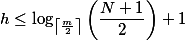

这个 B 树的高度公式从侧面显示了 B 树的查找效率是相当高的。为什么那？因为底数 m/2 可以取很大，如果 m 可以到达几千，从而在关键字数一定的情况下，使得最终的 h 值尽可能比较小，树的高度比较低。

树的高度降低了，磁盘的存取次数也随着树的高度降低而减少，从而使得存取性能也相应提升。

### 重点来了，B 树的插入、删除操作。

根据 B 树的性质可知，如果一棵 m 阶的 B 树，那么有如下规则：
* 树中每个节点含有最多 m 个孩子，即 m 满足：ceil(m/2)<=x<=m
* 除根节点和叶子节点外，其他每个节点至少有[ceil(m/2)] 个孩子。（ceil 是个取上线的函数）
* 除根节点外的节点的关键字的个数 n 必须满足：[ceil(m/2) -1] <=n<=m-1 （此条主要是针对关键字）

下面通过一个实例来对一个 B 树的插入、删除基本操作进行详细介绍。以一颗 5 阶的B树为例来进行讲解

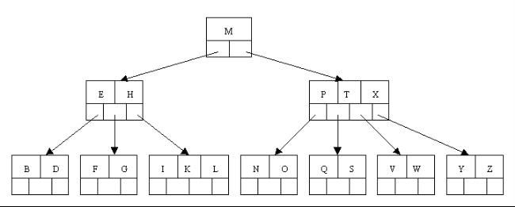

上图所示的一颗 5 阶的 B 树中，我们可以看到关键字 2-4 个，**内节点**孩子 3-5 个。关键字（个数 2-4）针对包括叶子节点在内的非根节点。同时，根节点必须至少 2 个孩子，不然就成了线性搜索树。关键字为大写字母，熟悉怒为字母升序。这里有个关键的概念，内节点，下面针对内外节点给出定义：
* 内节点：含有与页(磁盘地址)相关的键的引用的节点，比如上图的 E、H 和 P、T、X
* 外节点：含有指向实际数据的引用，比如上图的 B、D...Y、Z

#### 插入操作

针对一颗高度为 h 的 m 阶 B 树，插入一个元素时，首先在 B 树中判断是否存，如果不存在，一般在叶子节点中插入该新元素，此时分 3 种情况：
* 如果叶子及诶单空间足够，即该节点的关键字数小于 m-1，则直接插入在叶子节点的左边或者右边；（我感觉应该是小于等于 m-1）
* 如果空间满了以至于没有足够的空间去添加新的元素，即该节点的关键字数已经有了 m 个，则需要将该节点进行“分裂”，将一半数量的关键字元素分裂到新的其相邻的左右节点中，中间关键字元素上移到父节点中，而且当节点中的关键元素向右移动了，相关的指针也需要向右移动。
* 此外，如果在上述关键字在上移到父节点的过程中，导致根节点空间满了，那么根节点也需要进行分裂操作，这样原来的根节点中的中间关键字元素向上移动到新的根节点中，
因此导致树的高度增加一层。

下面我们通过一个实例来逐步讲解下。以下列字符为例，将其插入到一个 5 阶的B树中：C N G A H E K Q M F W L T Z D P R X Y S，而且，因为是 5 阶的 B 树，所以必须有**非根节点关键字数**小于2则需要进行合并，大于等于5个就需要分裂。

1. 首先，节点空间足够，刚开始的 4 个字母可以直接插入到相同的节点中，如下图所示：

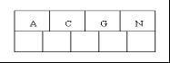

2. 插入 H 节点时，发现空间不够，所以将其分裂成 2 个节点，移动中间元素 G 上移到新的根节点，且把 A 和 C 留在当前节点中，而 H 和 N 放在新的右邻居中，如下图所示：

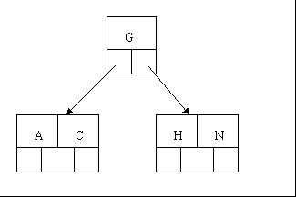

3. 当插入 E、K、Q 时，不需要任何分裂操作

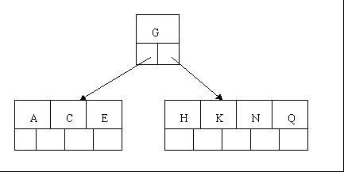

4. 插入 M 需要一次分裂，注意到 M 恰好是中间的关键元素(其实从这里可以看出，M 元素其实是插入了的，之后判断到达了 5 叉树的上限，需要进行分裂，M 上移)，所以 M向上移动到父节点中

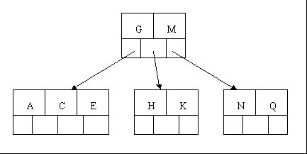

5. 插入 F、W、L、T不需要进行任何分裂操作

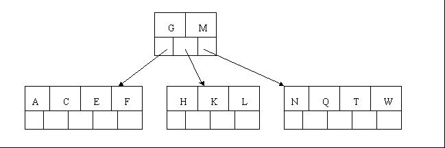

6. 插入 Z 时，最右侧的叶子结点空间满了，需要进行分裂，中间元素 T上移到父节点中

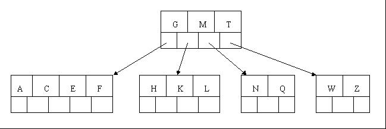

7. 插入 D 时，导致最左边的叶子结点被分裂，D 恰好也是中间元素，上移到父节点中，然后字母 P、R、X、Y 直接陆续插入，不需要任何分裂操作。

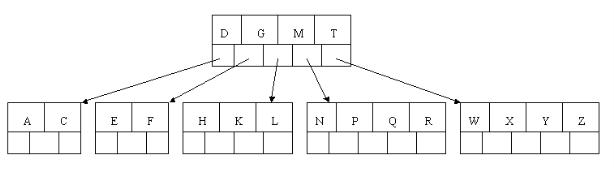

8. 最后，当插入 S 时，含有 N、P、Q、R 的节点需要分裂，把中间元素 Q 上移到父节点中，但是问题来了，因为 Q 上移导致父节点 “D G M T” 也满了，所以也要进行分裂，将父节点的中间元素 M 上移到新的根节点中，从而致使树的高度增加一层。


#### 删除（delete）操作

下面介绍删除操作，删除操作相对于插入操作要考虑的情况要多点。

* 首先查找 B 树中需要删除的元素，如果该元素在 B 树中存在，则将该元素在其节点中删除，如果删除该元素后，首先判断该院是否有左右孩子节点
* 如果有，则上移孩子节点中的某相近元素（“左孩子最右边的节点” 或者 “有孩子最左边的节点”）到父节点中，然后是移动之后的情况，继续递归判断
* 如果没有，则直接删除，然后是移动之后需要继续递归的情况。

删除元素，移动相应元素之后，如果某节点中元素数目（即关键字数）小于 ceil(m/2)-1，则需要看起某相邻的兄弟节点是否丰满（节点中元素个数大于 ceil(m/2)-1）
* 如果丰满，则向父节点借一个元素来满足条件；
* 如果相邻相兄弟也是刚刚脱贫，即兄弟节点借了之后其节点数目小于ceil(m/2)-1 ，该节点与其相邻的某一个兄弟节点“合并”成一个节点，一次来满足条件。

下满我们以上述插入的5阶B 树为例（**树中出根节点和叶子结点外的任意节点的孩子数 m 满足 3<=m<=5,除根节点外的任意节点的关键字数 n 满足 2<=n<=4 ,所以关键字数小于2就合并，超过4个就分裂**），依次删除 H、T、R、E

1. 首先删除元素 H，当然首先查找H，H 在一个叶子节点中，且该叶子节点的元素数目 3 大于最小元素数目 ceil(m/2)-1=2，则操作很简单，咱们只需要移动 k 至原来的 H 位置，移动L到K的位置（也就是被删除元素后面的元素向前移动）


2. 下一步，删除T，因为 T 没有在叶子节点中，而是在中间节点找到，我们发现它的继承者 W （字母升序的下一个元素），将 W 上移到 T 的位置，然后在包含 W 的子节点中将 W 关键字删除，这里删除 W 之后当前节点的元素个数大于 2 ，无需合并操作。

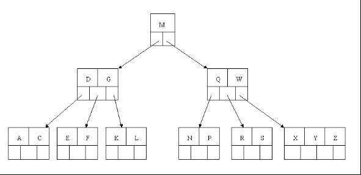

3. 下一步删除 R，R在的叶子节点中，但是该节点的元素数量为 2 ，删除导致只有 1 个元素，已经小于最小元素数目 ceil(5/2)-1=2 ，而由前面我们已经知道：**如果其兄弟节点比较丰满(数量>ceil(5/2)-1), 则可以向父节点借一个元素，然后将最丰满的相邻兄弟节点中上移最后或者最前一个元素到父节点中**（是不是有点红黑树左旋操作的影子？）。故在这个例子中，由于右相邻兄弟节点 “X Y Z” 比较丰满，而删除元素 S 后，到时 “S”节点稀缺

* 所以，原来的“R S” 节点先向父节点借一个元素 W 下移动到该叶子结点中，代替原来的 S 的位置，S 前移；（ps：为啥是让父节点中的W 下移，而不是 Q 下移，因为父节点中 W 节点大于被删除节点 R）
* 然后相邻兄弟节点中的 X 上移到父节点中
* 最后相邻兄弟节点中 Y 和 Z 元素前移。


4. 最后一步删除 E，删除后会导致很多问题，因为 E 所在的节点数目刚好达标，刚好满足最小元素个数 (ceil(5/2) -1=2), 而相邻的兄弟节点也是同一的情况，删除一个元素都不能满足条件，所以需要**该节点与某相邻兄弟节点进行合并操作；**

* 首先移动父节点中的元素（该元素在两个需要合并的两个节点元素之间）下移到其子节点中；
* 然后将这两个节点进行合并成一个节点。所以在该实例中，咱们先将父节点中的元素D 下移到已经删除 E 而只有 F 的节点中，然后将含有 D 和 F 的节点和 含有 AC 的相邻兄弟节点进行合并成一个节点。


也许我们认为这样删除操作已经结束了，其实不然，再看看上图，对于这种特殊情况，我们就会立即发现父节点只包含一个元素 G，没达标（因为非根节点包括叶子节点的关键字数 n 必须满足 2<=n<=4,而此处的 n=1），这是不能接受的.如果这个问题节点的相邻兄弟比较丰满，则可以向父节点借一个元素。但是右兄弟就是上文说的刚脱贫，向父节点借元素这个行为行不通，只能与兄弟节点进合并成一个节点，而根节点中的唯一元素 M 下移到子节点，这样，树的高度减少 1 层。


## B+ 树

B+ tree：是文件系统所需而产生的一种 B-tree 的变形树
一颗 m 阶的B+ 树和 m 阶的 B 树的异同点在于：
1. 有 n 棵子树的节点含有 n-1 个关键字；（与B树n棵子树有n-1个关键字保持一致）(ps:这个应该是相同点)
2. 所有的叶子节点包含了全部关键字的信息，以及指向这些关键字记录的指针，且叶子节点本身依关键字的大小自小而大的顺序链接。
（而 B 树的叶子节点并没有包含全部需要查找的信息）
3. **所有的非叶子节点可以看成是索引部分**，这些结点中仅包含有子树根节点中的最大（或最小）关键字。（而 B 树的非终结点也包含需要查找的有效信息）
4. B+ 树最下面的叶子节点是通过链表的形式彼此相连，有助于做范围查找


上图针对异同点1 可能是有问题的，关键字数是跟 B 树一样，是子节点的 个数 n-1 的
下图所示的来自维基百科的图是正确的

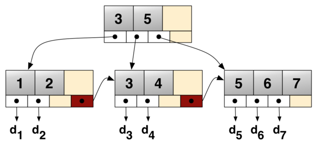

为什么说 B+ 树比 B 树更适合实际应用中的操作系统的文件索引和数据库索引？
1. B+ 树的磁盘读写代价更低，B+ 树的内部节点并没有执行关键字具体信息的指针。因此其内部节点相对 B 树更小。如果把所有同一内部节点关键字存放在同一块盘中，那么盘块所能容纳的关键字数量越多，一次性读入内存中需要查找的关键字也就越多，相对来说 IO 读写次数就降低了。

举个例子，假设磁盘中的一块盘块容纳 16 bytes，而一个关键字 2 bytes，一个关键字的具体指针信息 2 bytes。一颗 9 阶的 B tree（一个节点最多 8 个关键字）的 **内部节点** 需要 2 个盘块。而 B+ 树内部节点只需要 1 个盘块。当需要把内部节点读入内存的时候，B 树就比 B+ 树多一次盘块的查找时间(在磁盘中就是盘片的旋转时间)。

2. B+ 树的查询效率更加稳定

由于非终结点并不是最终指向文件内容的节点，而只是叶子节点中关键字的索引。所以任何关键字的查找都必须走根节点到叶子结点的路径，所有关键字查询的路径长度相同，
导致每个数据的查下效率相当。

总而言之，B 树在提高磁盘 IO 性能的同时并没有解决元素遍历的效率低下的问题。正是为了解决这个问题，B+ 树应运而生。B+树只要遍历叶子及诶单就可以实现整棵树的遍历，支持基于范围的查找，而 B 树不支持 range-query 这样的操作（或者说效率低）。总结一句话，就是 B+ 树查询相比 B 树 时间又少又稳。

## B* 树

B* 树是 B+ 树的变体，在 B+ 树的集成上，B* 树中非根和非叶子节点增加指向兄弟的节点；B* 树定义了非叶子节点关键字个数至少为（2/3）*M，即块的最低使用率为 2/3，代替了 B+ 树的 1/2，下面给出一个简单实例图

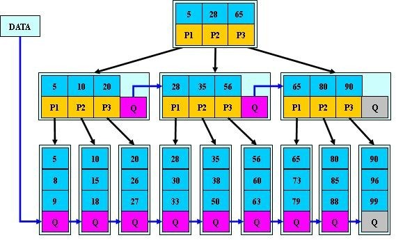

B+ 树的分裂：当一个节点满时，会分配一个新的节点，并将原节点中 1/2 的数据复制到新节点，最后在父节点中增加新节点的指针；B+ 树的分裂只影响原节点和父节点，而不会影响兄弟节点，所以它不需要指向兄弟的指针。

~~B* 树分裂：当一个节点满时，如果它的下一个兄弟未满，那么将一部分数据转移到兄弟节点中，再在原节点插入关键字~~

## 总结：
* B树：有序数组+平衡多叉树
* B+树：有序数组链表+平衡多叉树
* B*树：一颗丰满的 B+ 树