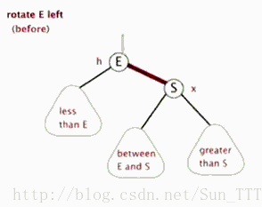
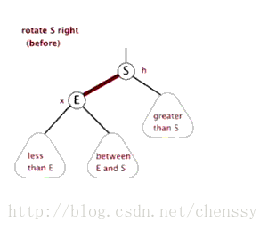

红黑树
1、变更颜色的情况：当前节点的父节点是红色，且它的叔叔节点也是红色，
    1.1 把父节点的颜色设为黑色
    1.2 把叔叔节点的颜色设置为黑色
    1.3 把祖父的节点设置为红色
    1.4 把指针指向祖父节点，并设置当前的节点为祖父节点，判断红黑树的性质是否被破坏。
2、左旋：当前父节点是红色，叔叔节点是黑色，且当前节点是右子树的时候，进行左旋，以父节点为作为左旋开始节点？？

3、右旋：当前父节点是红色，叔叔是黑色的时候，且当前节点是左子树，需要右旋。右旋注意事项：
    3.1 把父节点变为黑色
    3.2 把祖父节点变为红色
    3.3 以祖父节点旋转

